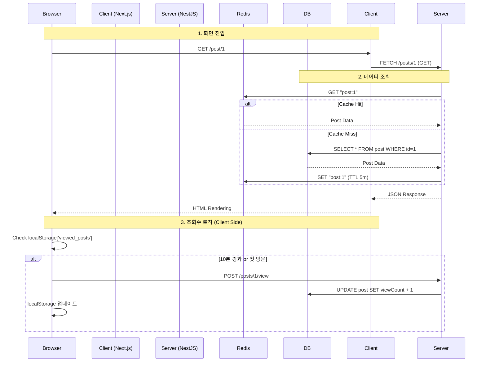
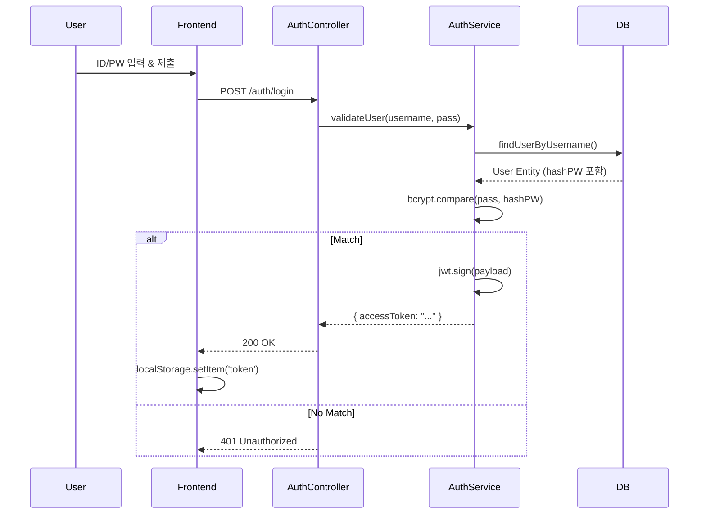

# 🗺️ Jungle 14 CodeWiki

이 문서는 **Jungle 14** 프로젝트의 소스 코드 레벨 상세 가이드입니다. 개발자가 코드를 수정하거나 기능을 추가할 때 네비게이션으로 사용할 수 있도록 구성되었습니다.

---

## 📑 목차 (Table of Contents)

1.  [📂 System Overview (시스템 개요)](#-system-overview)
2.  [🏗️ Backend Structure (서버 구조)](#%EF%B8%8F-backend-structure)
    *   [Posts Module (게시물)](#1-posts-module-serversrcposts)
    *   [Auth Module (인증)](#2-auth-module-serversrcauth)
    *   [Core Config (설정)](#3-core-config-serversrc)
3.  [💻 Frontend Structure (클라이언트 구조)](#-frontend-structure)
    *   [App Directory (페이지)](#1-app-directory-clientapp)
4.  [🔄 Logic Trace (로직 추적)](#-logic-trace)
    *   [Scenario 1: 게시물 상세 조회 & 조회수 증가](#scenario-1-게시물-상세-조회--조회수-증가)
    *   [Scenario 2: 로그인 & 토큰 발급](#scenario-2-로그인--토큰-발급)

---

## 📂 System Overview

### 기술 아키텍처 (Tech Stack)

| Layer | Tech | Key Libraries |
| :--- | :--- | :--- |
| **Frontend** | **Next.js 14** | React, TailwindCSS, Lucide Icons |
| **Backend** | **NestJS 10** | TypeORM, Passport, CacheManager |
| **Database** | **PostgreSQL** | `pg`, `typeorm` |
| **Infra** | **Docker** | `docker-compose` (Planned), `Dockerfile` |

### 디렉토리 맵 (Directory Map)

주요 파일만 표기했습니다. 클릭하면 관련 설명으로 이동합니다.

```text
jungle 14/
├── 📂 client/ ............................ [Frontend Root]
│   ├── 📂 app/
│   │   ├── 📂 post/[id]/
│   │   │   ├── 📄 page.tsx ............... SSR: 게시물 상세 데이터 Fetch
│   │   │   └── 📄 PostDetailClient.tsx ... CSR: 조회수 로직, 삭제 버튼
│   │   └── 📄 page.tsx ................... Main: 게시물 목록 Grid
│   └── 📂 components/
│       └── 📄 Navigation.tsx ............. GNB: 로그인 상태 감지
│
└── 📂 server/ ............................ [Backend Root]
    ├── 📂 src/
    │   ├── 📂 posts/
    │   │   ├── 📄 posts.controller.ts .... API: /posts 라우팅
    │   │   ├── 📄 posts.service.ts ....... Logic: 캐싱, DB 호출
    │   │   ├── 📄 posts.repository.ts .... DB: TypeORM QueryBuilder
    │   │   └── 📄 post.entity.ts ......... Schema: DB 테이블 정의
    │   │
    │   ├── 📂 auth/
    │   │   ├── 📄 auth.service.ts ........ Logic: 로그인/회원가입
    │   │   └── 📄 jwt.strategy.ts ........ Guard: 토큰 검증 전략
    │   │
    │   ├── 📄 app.module.ts .............. Root: Redis/DB 설정 연결
    │   └── 📄 main.ts .................... Entry: Port, CORS, Filter
    └── 📄 .env ........................... Config: 비밀키, DB 접속정보
```

---

## 🏗️ Backend Structure

서버 로직의 핵심인 NestJS 모듈들을 분석합니다.

### 1. Posts Module (`server/src/posts/`)
게시판의 핵심 기능(CRUD, 조회수)을 담당합니다.

*   **`posts.controller.ts`**
    *   **역할**: HTTP 요청 진입점.
    *   **주요 메서드**:
        *   `@Get(':id')`: 상세 조회. `service.findOne` 호출.
        *   `@Post(':id/view')`: **조회수 증가 엔드포인트**. 반환값 없이 카운트만 올림.
        *   `@UseGuards(JwtAuthGuard)`: `create`, `update`, `remove`에 붙어 비회원 차단.
*   **`posts.service.ts`**
    *   **역할**: 비즈니스 로직 & 캐싱 전략 수행.
    *   **핵심 로직 (Caching)**:
        *   `findAll`: **Cache-Aside 패턴**. Redis에 `posts` 키 확인 → 없으면 DB 조회 → Redis에 1분간 저장.
        *   `findOne`: Redis에 `post:ID` 키 확인 → 없으면 DB 조회 → Redis에 5분간 저장.
        *   `create/update/delete`: 데이터 변경 시 `this.cacheManager.del('posts')`를 호출하여 목록 캐시 무효화.
*   **`posts.repository.ts`**
    *   **역할**: DB 접근 계층 (Custom Repository).
    *   **특이사항**: `DataSource`를 주입받아 사용. `findOne` 시 `relations: ['author']` 없이도 Entity의 `eager: true` 설정 덕분에 작성자 정보 자동 로드.
*   **`post.entity.ts`**
    *   **스키마**: `title`, `content`, `viewCount`, `author` (ManyToOne).

### 2. Auth Module (`server/src/auth/`)
보안 및 사용자 인증을 담당합니다.

*   **`auth.controller.ts`**: `/auth/login`, `/auth/register` 요청 처리.
*   **`auth.service.ts`**:
    *   `login`: 사용자 검증 후 `jwtService.sign(payload)`로 토큰 발급.
    *   `register`: `bcrypt.hash(password)`로 비밀번호 암호화 후 저장.
*   **`jwt.strategy.ts`**:
    *   **역할**: `AuthGuard`가 실행될 때 호출됨.
    *   **로직**: 헤더의 `Authorization: Bearer <token>`을 파싱하여 유효성 검사. 성공 시 `req.user`에 사용자 정보 주입.

### 3. Core Config (`server/src/`)
*   **`app.module.ts`**:
    *   `TypeOrmModule`: PostgreSQL 연결 설정 (`synchronize: true` 주의 - 개발용).
    *   `CacheModule`: Redis 연결 설정 (`isGlobal: true`).
*   **`main.ts`**:
    *   `enableCors`: 프론트엔드(`localhost:3001`) 접근 허용 및 `credentials: true`(쿠키 등) 설정.
    *   `ValidationPipe`: DTO(`class-validator`) 기반 데이터 검증 활성화.

---

## 💻 Frontend Structure

Next.js App Router 구조를 따릅니다.

### 1. App Directory (`client/app/`)
*   **`post/[id]/page.tsx` (Server Component)**
    *   **역할**: 데이터 Fetching 및 메타데이터 처리.
    *   **로직**: `fetch('.../posts/id')`로 데이터를 가져와 `PostDetailClient`에 props로 전달. `cache: 'no-store'`로 설정되어 있어 항상 최신 데이터를 받아옴 (하지만 백엔드가 Redis 캐시된 데이터를 줄 수 있음).
*   **`post/[id]/PostDetailClient.tsx` (Client Component)**
    *   **역할**: 브라우저 전용 로직 (localStorage, 클릭 이벤트).
    *   **핵심 로직 (View Count)**:
        1.  `useEffect` 실행.
        2.  `localStorage.getItem('viewed_posts')` 확인.
        3.  해당 ID의 마지막 조회 시간이 없거나 10분 지났으면 `POST /view` API 호출.
        4.  현재 시간을 localStorage에 갱신.
*   **`components/Navigation.tsx`**
    *   **역할**: 전역 네비게이션 바.
    *   **로직**: `localStorage`에 토큰이나 유저 정보가 있으면 '로그아웃/프로필', 없으면 '로그인/회원가입' 버튼 표시. `useEffect`로 클라이언트 마운트 후 상태 확인.

---

## 🔄 Logic Trace

개발자가 가장 자주 수정할 기능들의 실행 흐름입니다.

### Scenario 1: 게시물 상세 조회 & 조회수 증가

사용자가 게시물을 클릭했을 때 벌어지는 일.



### Scenario 2: 로그인 & 토큰 발급



---

이 문서는 프로젝트의 구조 변경 시 함께 업데이트되어야 합니다.
