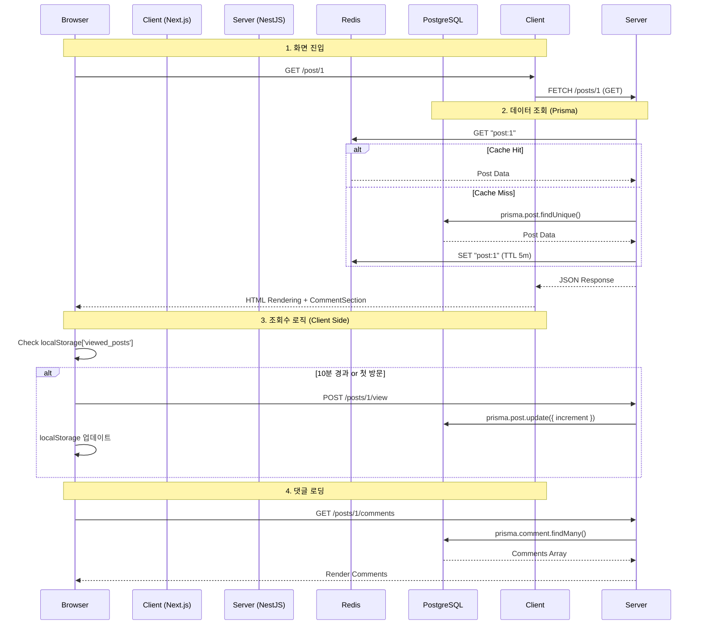
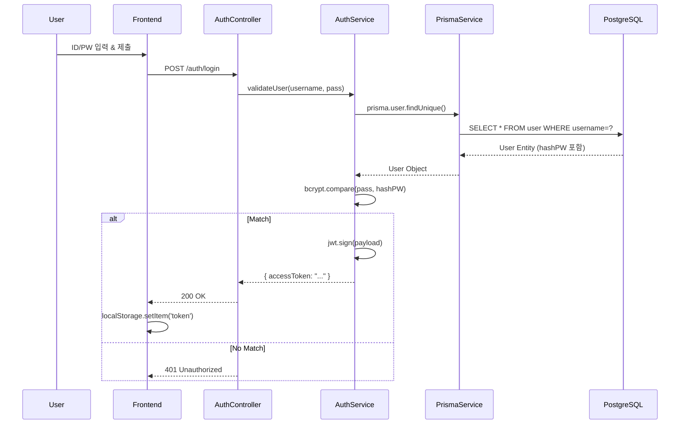
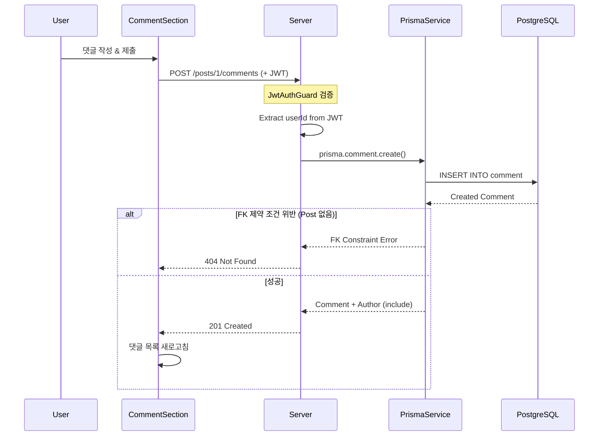

# 🗺️ Jungle 14 CodeWiki

이 문서는 **Jungle 14** 프로젝트의 소스 코드 레벨 상세 가이드입니다. 개발자가 코드를 수정하거나 기능을 추가할 때 네비게이션으로 사용할 수 있도록 구성되었습니다.

---

## 📑 목차 (Table of Contents)

1.  [📂 System Overview (시스템 개요)](#-system-overview)
2.  [🏗️ Backend Structure (서버 구조)](#%EF%B8%8F-backend-structure)
    *   [Prisma Module (ORM)](#1-prisma-module-serversrcprisma)
    *   [Posts Module (게시물)](#2-posts-module-serversrcposts)
    *   [Comments Module (댓글)](#3-comments-module-serversrccomments)
    *   [Auth Module (인증)](#4-auth-module-serversrcauth)
    *   [Core Config (설정)](#5-core-config-serversrc)
3.  [💻 Frontend Structure (클라이언트 구조)](#-frontend-structure)
    *   [App Directory (페이지)](#1-app-directory-clientapp)
    *   [Components (컴포넌트)](#2-components-clientcomponents)
4.  [🔄 Logic Trace (로직 추적)](#-logic-trace)
    *   [Scenario 1: 게시물 상세 조회 & 조회수 증가](#scenario-1-게시물-상세-조회--조회수-증가)
    *   [Scenario 2: 로그인 & 토큰 발급](#scenario-2-로그인--토큰-발급)
    *   [Scenario 3: 댓글 작성 & 권한 검증](#scenario-3-댓글-작성--권한-검증)

---

## 📂 System Overview

### 기술 아키텍처 (Tech Stack)

| Layer        | Tech           | Key Libraries                                                         |
| :----------- | :------------- | :-------------------------------------------------------------------- |
| **Frontend** | **Next.js 16** | React 19, TailwindCSS v4, Lucide Icons, **TipTap (Rich Text Editor)** |
| **Backend**  | **NestJS 10**  | **Prisma**, Passport, CacheManager                                    |
| **Database** | **PostgreSQL** | Prisma Client, pg                                                     |
| **Cache**    | **Redis**      | cache-manager-redis-yet                                               |
| **Infra**    | **Docker**     | PostgreSQL, Redis                                                     |

### 디렉토리 맵 (Directory Map)

주요 파일만 표기했습니다.

```text
jungle 14/
├── 📂 client/ ............................ [Frontend Root]
│   ├── 📂 app/
│   │   ├── 📂 post/[id]/
│   │   │   ├── 📄 page.tsx ............... SSR: 게시물 상세 데이터 Fetch
│   │   │   └── 📄 PostDetailClient.tsx ... CSR: 조회수 로직, 댓글 섹션
│   │   ├── 📂 search/
│   │   │   └── 📄 page.tsx ............... 검색 결과 페이지
│   │   └── 📄 page.tsx ................... Main: 무한 스크롤 게시물 목록
│   └── 📂 components/
│       ├── 📄 Navigation.tsx ............. GNB: 로그인 상태 감지
│       ├── 📄 RichEditor.tsx ............. TipTap 기반 Rich Text Editor
│       ├── 📄 CommentSection.tsx ......... 댓글 CRUD 컴포넌트
│       ├── 📄 InfiniteScrollPosts.tsx .... 무한 스크롤 구현
│       └── 📄 SearchBar.tsx .............. 검색 입력 컴포넌트
│
└── 📂 server/ ............................ [Backend Root]
    ├── 📂 prisma/
    │   └── 📄 schema.prisma .............. DB 스키마 정의 (Prisma)
    ├── 📂 src/
    │   ├── 📂 prisma/
    │   │   ├── 📄 prisma.service.ts ...... Prisma Client 관리
    │   │   └── 📄 prisma.module.ts ....... Global Prisma Module
    │   │
    │   ├── 📂 posts/
    │   │   ├── 📄 posts.controller.ts .... API: /posts 라우팅
    │   │   ├── 📄 posts.service.ts ....... Logic: 캐싱, Prisma 쿼리
    │   │   └── 📂 dto/
    │   │       ├── pagination.dto.ts ..... 페이지네이션 DTO
    │   │       └── search.dto.ts ......... 검색 DTO
    │   │
    │   ├── 📂 comments/
    │   │   ├── 📄 comments.controller.ts . API: /comments, /posts/:id/comments
    │   │   ├── 📄 comments.service.ts .... Logic: 댓글 CRUD
    │   │   └── 📂 dto/
    │   │
    │   ├── 📂 auth/
    │   │   ├── 📄 auth.service.ts ........ Logic: 로그인/회원가입
    │   │   └── 📄 jwt.strategy.ts ........ Guard: 토큰 검증 전략
    │   │
    │   ├── 📄 app.module.ts .............. Root: Prisma/Redis 설정
    │   └── 📄 main.ts .................... Entry: Port, CORS, Filter
    └── 📄 .env ........................... Config: DATABASE_URL, JWT_SECRET
```

---

## 🏗️ Backend Structure

서버 로직의 핵심인 NestJS 모듈들을 분석합니다.

### 1. Prisma Module (`server/src/prisma/`)
**Prisma ORM**을 통한 데이터베이스 접근을 담당합니다.

*   **`prisma.service.ts`**
    *   **역할**: Prisma Client를 생성하고 연결을 관리.
    *   **핵심 로직**:
        - Prisma 7 호환: `@prisma/adapter-pg` 사용
        - Pool 기반 연결 관리
        - `onModuleInit`: `$connect()` 호출 (앱 시작 시)
        - `onModuleDestroy`: `$disconnect()` 호출 (앱 종료 시)
    *   **특징**: `PrismaClient`를 extend하여 타입 안전성 보장.

*   **`prisma.module.ts`**
    *   **역할**: PrismaService를 전역으로 제공.
    *   **`@Global()`**: 모든 모듈에서 import 없이 PrismaService 사용 가능.

*   **`schema.prisma`**
    *   **역할**: 데이터베이스 스키마 정의 (Single Source of Truth).
    *   **모델**: User, Post, Comment
    *   **관계**:
        - User ↔ Post (OneToMany)
        - User ↔ Comment (OneToMany)
        - Post ↔ Comment (OneToMany, Cascade Delete)
    *   **인덱스**: `@@index([authorId])`, `@@index([createdAt])`, `@@index([postId])`

### 2. Posts Module (`server/src/posts/`)
게시판의 핵심 기능(CRUD, 조회수, 페이지네이션, 검색)을 담당합니다.

*   **`posts.controller.ts`**
    *   **역할**: HTTP 요청 진입점.
    *   **주요 엔드포인트**:
        - `@Get()`: 페이지네이션 적용 (`?page=1&limit=10`)
        - `@Get('search')`: 검색 (`?query=키워드&type=title`)
        - `@Get(':id')`: 상세 조회
        - `@Post(':id/view')`: 조회수 증가
        - `@UseGuards(JwtAuthGuard)`: `create`, `update`, `remove`에 인증 필요

*   **`posts.service.ts`**
    *   **역할**: 비즈니스 로직 & 캐싱 전략.
    *   **핵심 로직**:
        - **캐싱 (Cache-Aside 패턴)**:
            - `findAll`: Redis에 `posts` 키 확인 → 없으면 DB 조회 → 1분 캐싱
            - `findOne`: Redis에 `post:ID` 확인 → 없으면 DB 조회 → 5분 캐싱
            - `create/update/delete`: `cacheManager.del('posts')` 호출
        - **페이지네이션**:
            ```typescript
            const [data, total] = await Promise.all([
              this.prisma.post.findMany({ skip, take, include: { author: true } }),
              this.prisma.post.count(),
            ]);
            ```
        - **검색**:
            ```typescript
            where: {
              title: { contains: query, mode: 'insensitive' }  // 대소문자 무시
            }
            ```
        - **조회수 증가 (Atomic)**:
            ```typescript
            await this.prisma.post.update({
              where: { id },
              data: { viewCount: { increment: 1 } },
            });
            ```

*   **`dto/pagination.dto.ts`**
    *   `page`, `limit` 필드 정의
    *   `PaginatedResult<T>` 인터페이스 (data, total, page, limit, totalPages)

*   **`dto/search.dto.ts`**
    *   PaginationDto 상속
    *   `query` (검색어), `type` (title | content | author)

### 3. Comments Module (`server/src/comments/`)
댓글 기능을 담당합니다.

*   **`comments.controller.ts`**
    *   **주요 엔드포인트**:
        - `GET /posts/:postId/comments`: 댓글 목록
        - `POST /posts/:postId/comments`: 댓글 작성 (인증 필요)
        - `PATCH /comments/:id`: 댓글 수정 (본인만)
        - `DELETE /comments/:id`: 댓글 삭제 (본인만)

*   **`comments.service.ts`**
    *   **핵심 로직**:
        - **권한 검증**: `comment.authorId !== userId` 체크
        - **Prisma 관계 생성**:
            ```typescript
            await this.prisma.comment.create({
              data: { content, postId, authorId: userId },
              include: { author: true },  // N+1 방지
            });
            ```
        - **Cascade 삭제**: Post 삭제 시 댓글 자동 삭제 (Prisma 스키마에서 정의)

### 4. Auth Module (`server/src/auth/`)
보안 및 사용자 인증을 담당합니다.

*   **`auth.controller.ts`**: `/auth/login`, `/auth/register` 요청 처리.
*   **`auth.service.ts`**:
    *   `login`: Prisma로 사용자 검증 후 JWT 발급
    *   `register`: bcrypt.hash로 비밀번호 암호화 후 Prisma로 저장
*   **`jwt.strategy.ts`**:
    *   **역할**: `AuthGuard`가 실행될 때 호출됨.
    *   **로직**: 헤더의 `Authorization: Bearer <token>` 파싱 → 유효성 검사 → `req.user`에 정보 주입

### 5. Core Config (`server/src/`)
*   **`app.module.ts`**:
    *   `PrismaModule`: Global module로 등록
    *   `CacheModule`: Redis 연결 (`isGlobal: true`)
*   **`main.ts`**:
    *   `enableCors`: 프론트엔드 접근 허용 (`localhost:3001`, `credentials: true`)
    *   `ValidationPipe`: DTO 기반 데이터 검증

---

## 💻 Frontend Structure

Next.js App Router 구조를 따릅니다.

### 1. App Directory (`client/app/`)
*   **`page.tsx` (Main - Client Component)**
    *   **역할**: 무한 스크롤 게시물 목록.
    *   **컴포넌트**: `InfiniteScrollPosts`, `SearchBar`

*   **`post/[id]/page.tsx` (Server Component)**
    *   **역할**: 게시물 상세 데이터 Fetching.
    *   **로직**: `fetch('.../posts/id')`로 데이터 가져와 `PostDetailClient`에 전달.

*   **`post/[id]/PostDetailClient.tsx` (Client Component)**
    *   **역할**: 조회수 로직, 삭제 버튼, 댓글 섹션.
    *   **핵심 로직 (View Count)**:
        1. `useEffect` 실행
        2. `localStorage.getItem('viewed_posts')` 확인
        3. 10분 지났으면 `POST /posts/:id/view` API 호출
        4. 현재 시간을 localStorage에 저장
    *   **댓글 섹션**: `<CommentSection postId={post.id} />` 렌더링

*   **`search/page.tsx` (Client Component)**
    *   **역할**: 검색 결과 표시.
    *   **로직**: URL 쿼리 파라미터(`?query=...&type=...`)로 검색 조건 받아서 API 호출.

### 2. Components (`client/components/`)
*   **`Navigation.tsx`**
    *   **역할**: 전역 네비게이션 바.
    *   **로직**: localStorage에 토큰 있으면 '로그아웃/프로필', 없으면 '로그인/회원가입' 표시.

*   **`CommentSection.tsx`**
    *   **역할**: 댓글 CRUD 컴포넌트.
    *   **기능**:
        - 댓글 목록 표시
        - 댓글 작성 폼
        - 본인 댓글만 수정/삭제 버튼
        - 실시간 업데이트 (작성/수정/삭제 후 자동 새로고침)

*   **`InfiniteScrollPosts.tsx`**
    *   **역할**: 무한 스크롤 구현.
    *   **기술**: Intersection Observer API
    *   **로직**:
        1. Observer가 타겟 div 감지
        2. `page` state 증가
        3. `fetchPosts(page)` 호출
        4. 기존 posts 배열에 append

*   **`SearchBar.tsx`**
    *   **역할**: 검색 입력 컴포넌트.
    *   **기능**: 검색 타입 선택 (제목/내용/작성자) + 검색어 입력 → `/search` 페이지로 이동

*   **`RichEditor.tsx`**
    *   **역할**: TipTap 기반 Rich Text Editor 컴포넌트.
    *   **주요 기능**:
        - **한글 폰트 10종 지원**: 산하엽, 마루부리, 구름산스 등
        - **폰트 크기 조절**: 12px ~ 32px (8단계)
        - **텍스트 정렬**: 좌/중/우 정렬
        - **볼드 스타일**: 굵은 글씨 적용
        - **실시간 동기화**: 드롭다운이 현재 선택된 스타일 반영
    *   **기술 스택**:
        - `@tiptap/react` - React용 TipTap
        - `@tiptap/starter-kit` - 기본 에디터 기능
        - `@tiptap/extension-text-align` - 텍스트 정렬
        - `@tiptap/extension-text-style` - 텍스트 스타일
        - `@tiptap/extension-font-family` - 폰트 패밀리
    *   **핵심 구현**:
        ```typescript
        // 커스텀 FontSize Extension
        const FontSize = Extension.create({
          name: 'fontSize',
          addGlobalAttributes() {
            return [{
              types: ['textStyle'],
              attributes: {
                fontSize: {
                  parseHTML: (element) => element.style.fontSize || null,
                  renderHTML: (attrs) => ({ style: `font-size: ${attrs.fontSize}` }),
                },
              },
            }];
          },
        });
        
        // 상태 동기화
        onUpdate: ({ editor }) => {
          const attrs = editor.getAttributes('textStyle');
          setSelectedFont(attrs.fontFamily || '');
          setSelectedSize(attrs.fontSize || '');
        }
        ```
    *   **접근성**:
        - 모든 도구에 `aria-label` 추가
        - 버튼에 `aria-pressed` 상태 표시
        - 키보드 내비게이션 지원
    *   **XSS 방어** (write/page.tsx):
        ```typescript
        // Client-side only DOMPurify 로딩
        useEffect(() => {
          import('dompurify').then((module) => {
            setDOMPurify(module.default);
          });
        }, []);
        
        // HTML Sanitization
        const sanitizedContent = DOMPurify.sanitize(content, {
          ALLOWED_TAGS: ['p', 'br', 'b', 'strong', 'span', ...],
          ALLOWED_ATTR: ['style'],
        });
        ```

---

## 🔄 Logic Trace

개발자가 가장 자주 수정할 기능들의 실행 흐름입니다.

### Scenario 1: 게시물 상세 조회 & 조회수 증가

사용자가 게시물을 클릭했을 때 벌어지는 일.



### Scenario 2: 로그인 & 토큰 발급



### Scenario 3: 댓글 작성 & 권한 검증



---

## 🎯 Prisma 핵심 특징

### 1. Repository 패턴 불필요
```typescript
// ❌ TypeORM (Before)
this.postsRepository.findById(id)

// ✅ Prisma (After)
this.prisma.post.findUnique({ where: { id } })
```

### 2. 타입 안전성
```typescript
import { User, Post, Comment } from '@prisma/client';

// 컴파일 타임 타입 체크
const post = await this.prisma.post.findUnique({ ... });
//                            ^^^^ 자동 완성 지원
```

### 3. N+1 문제 방지
```typescript
const posts = await this.prisma.post.findMany({
  include: { author: true },  // LEFT JOIN으로 한 번에 로딩
});
```

### 4. Atomic 연산
```typescript
// Race condition 방지
await this.prisma.post.update({
  where: { id },
  data: { viewCount: { increment: 1 } },
});
```

---

이 문서는 프로젝트의 구조 변경 시 함께 업데이트되어야 합니다.

**마지막 업데이트**: Prisma 마이그레이션 완료 (2025.12.15)
