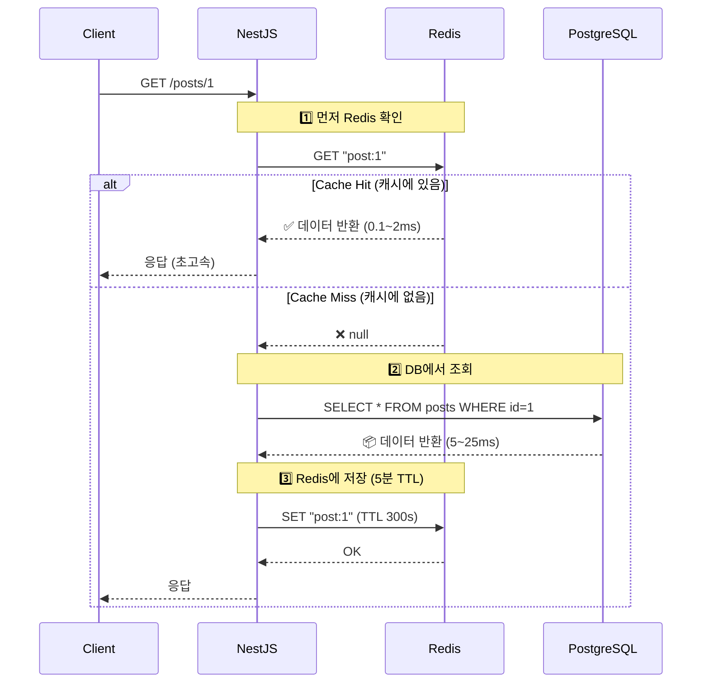
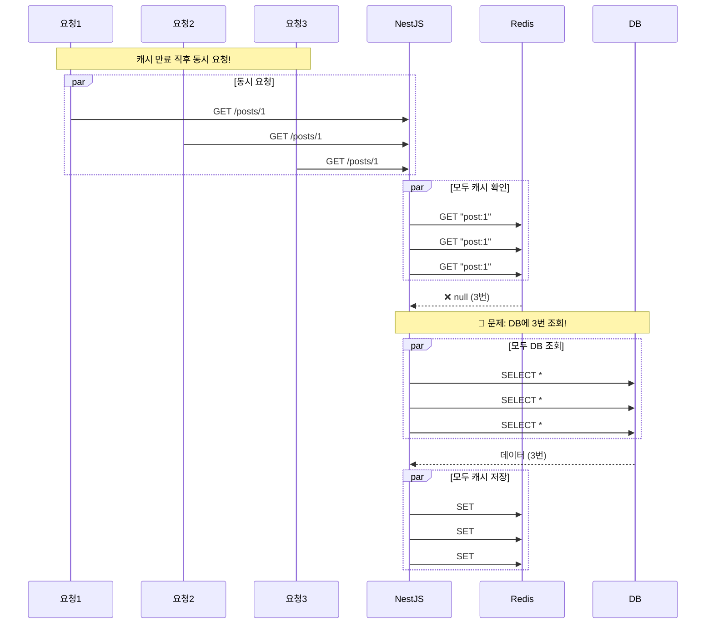
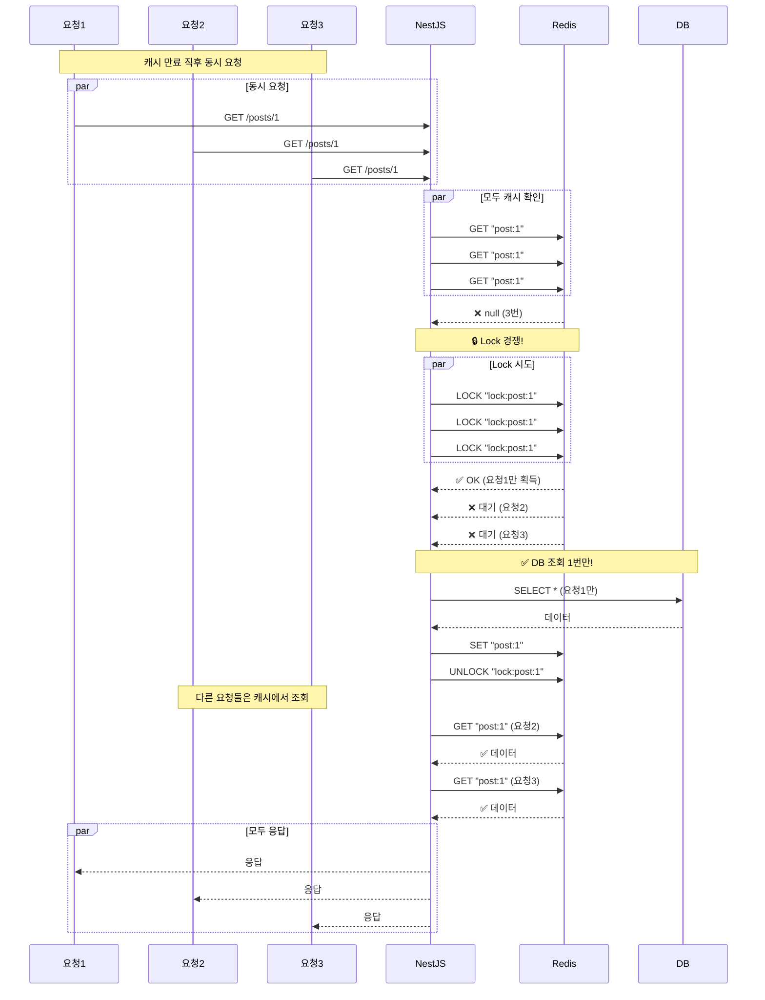
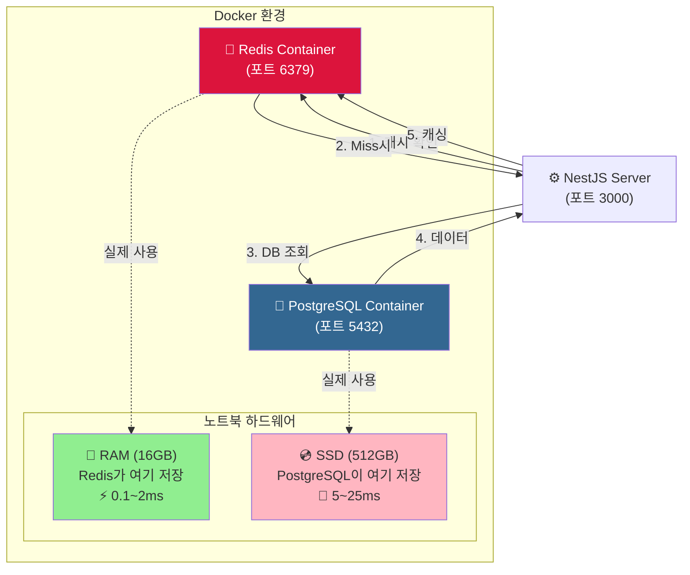

# ⚡ Redis 캐싱 구현

## 1. 📚 개념 (Concept)

### 1.1 Caching in NestJS
> "캐싱은 앱의 성능을 향상시키는 훌륭하고 간단한 기술입니다. 캐싱은 데이터 조회와 같이 비용이 많이 드는 작업의 결과를 임시 저장소(캐시)에 저장하고, 다음 요청 시 저장된 데이터를 반환하여 작업을 건너뛰는 방식으로 작동합니다." - *NestJS 공식 문서*

NestJS는 `CACHE_MANAGER`를 통해 통합된 캐시 인터페이스를 제공하며, 기본 메모리 스토어 외에 Redis 같은 외부 스토어를 쉽게 연결할 수 있습니다.

### 1.2 Redis (Remote Dictionary Server)
> "Redis는 오픈 소스(BSD 라이선스), 인메모리 데이터 구조 저장소로, 데이터베이스, 캐시, 메시지 브로커로 사용됩니다." - *Redis 공식 문서*
> "속도가 빠르기로 유명하며, 평균 읽기/쓰기 작업이 1ms 미만이 소요됩니다." - *AWS ElastiCache 문서*

우리는 Redis를 **Docker 컨테이너**로 실행하여 애플리케이션의 영구적인 설정 변경 없이도 쉽게 캐싱 환경을 구축했습니다.

---

## 2. 🗺️ 구현 계획 (Implementation Plan)

### 2.1 인프라 구축
1.  **Docker Redis**: `redis:7` 이미지를 사용하여 컨테이너 실행.
2.  **Port Forwarding**: 호스트의 `6379` 포트를 컨테이너의 `6379` 포트에 연결.

### 2.2 NestJS 설정
1.  **Dependencies**: `@nestjs/cache-manager`, `cache-manager`, `cache-manager-redis-yet` 설치.
2.  **Module Config**: `AppModule`에서 `CacheModule.registerAsync`를 사용하여 전역(Global)으로 설정.

### 2.3 캐싱 전략 (Caching Strategy)
1.  **Manual Caching**: 데코레이터(`@UseInterceptors(CacheInterceptor)`) 대신 `Inject(CACHE_MANAGER)`를 사용하여 직접 제어.
    *   이유: 데이터 변경(생성/수정/삭제) 시 정확한 시점에 캐시를 무효화(Invalidation)하기 위함.
2.  **TTL (Time To Live) 설정**:
    *   **게시물 목록 (`posts`)**: **1분** (빈번한 조회, 적당한 신선도 유지)
    *   **게시물 상세 (`post:id`)**: **5분** (상대적으로 긴 시간 유지)
3.  **Invalidation**: 게시물 생성/수정/삭제 시 `posts` 캐시(목록)를 즉시 삭제하여 데이터 일관성 보장.

---

## 3. 💻 실제 구현 코드 (Implementation Code)

### 3.1 모듈 설정 (`app.module.ts`)

```typescript
// server/src/app.module.ts

@Module({
  imports: [
    // ...
    CacheModule.registerAsync({
      isGlobal: true, // 전역 모듈로 설정 (어디서든 주입 가능)
      useFactory: async () => ({
        store: await redisStore({
          socket: {
            host: 'localhost', // Docker 컨테이너 주소 (로컬)
            port: 6379,
          },
          ttl: 60000, // 기본 TTL (1분)
        }),
      }),
    }),
  ],
  // ...
})
export class AppModule {}
```

### 3.2 서비스 구현 (`posts.service.ts`)

```typescript
// server/src/posts/posts.service.ts

@Injectable()
export class PostsService {
  constructor(
    // ...
    @Inject(CACHE_MANAGER) private cacheManager: Cache, // 캐시 매니저 주입
  ) {}

  // 전체 조회: Cache-First 전략
  async findAll(): Promise<Post[]> {
    // 1. Redis 캐시 확인
    const cached = await this.cacheManager.get<Post[]>('posts');
    if (cached) {
      console.log('✅ 목록 캐시 히트!');
      return cached;
    }

    // 2. 캐시 미스 -> DB 조회
    console.log('💾 DB 조회');
    const posts = await this.postsRepository.findAll();

    // 3. 캐시 저장 (TTL: 60초)
    await this.cacheManager.set('posts', posts, 60000);

    return posts;
  }

  // 상세 조회
  async findOne(id: number): Promise<Post> {
    // 1. 캐시 확인
    const cached = await this.cacheManager.get<Post>(`post:${id}`);
    if (cached) {
      console.log(`✅ 게시물 ${id} 캐시 히트!`);
      return cached;
    }

    // 2. DB 조회
    console.log(`💾 게시물 ${id} DB 조회`);
    const post = await this.postsRepository.findById(id);

    // 3. 캐시 저장 (TTL: 5분 = 300,000ms)
    await this.cacheManager.set(`post:${id}`, post, 300000);

    return post;
  }

  // 데이터 변경 시 캐시 무효화
  async create(createPostDto: CreatePostDto, userId: number): Promise<Post> {
    // ... DB 저장 로직 ...

    // 캐시 삭제: 목록이 변경되었으므로 'posts' 키 삭제
    await this.cacheManager.del('posts');
    return post;
  }
}
```

---

## 4. 📝 추가 내용 (Additional Notes)

### 4.1 성능 개선 효과
*   **DB 조회**: 평균 **5~25ms** 소요.
*   **Redis 조회**: 평균 **0.1~2ms** 소요.
*   약 **10배 이상의 응답 속도 향상**을 기대할 수 있습니다.

### 4.2 주의사항 (Cache Stampede)
*   TTL이 만료되는 순간 수많은 요청이 동시에 DB로 몰리는 현상(Cache Stampede)이 발생할 수 있습니다.
*   현재는 `cache-manager`가 기본적인 방어를 해주지만, 트래픽이 매우 높을 경우 `redis-lock` 등을 고려해야 합니다.

---

## 5. 📊 다이어그램 (Diagrams)

### 5.1 🔄 Cache-Aside 패턴 (현재 구현)



### 5.2 🚨 Cache Stampede 문제 (Lock 없을 때)



### 5.3 ✅ Redis Lock 사용 (해결책)



### 5.4 🏗️ 아키텍처 다이어그램



---

## 6. 💡 결론

현재 프로젝트는 **Redis Lock 없이 기본 Cache-Aside 패턴**을 사용하고 있습니다.

**현재 상태**:
- ✅ 소규모 트래픽에 적합
- ✅ 성능 개선 효과 10배 이상
- ⚠️ 고트래픽 시 Cache Stampede 가능

**향후 개선 (프로덕션)**:
- Redis Lock (Redlock) 구현
- 분산 캐싱 전략
- 캐시 워밍 (Warming) 전략
