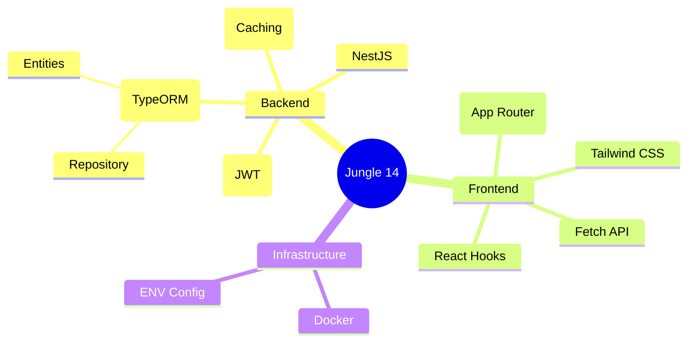

# 🗺️ Jungle 14 Project 구조 가이드북

이 문서는 프로젝트의 전체 구조를 **백엔드, 프론트엔드, 데이터 흐름, 인프라** 네 가지 핵심 영역으로 나누어 설명합니다. 마인드맵을 보듯이 전체 그림을 이해하고, 각 코드가 어떤 역할을 하는지 파악하는 데 도움을 줍니다.

---

## 🏗️ 1. Backend (Server)

백엔드는 **NestJS** 프레임워크를 기반으로 하며, 데이터 처리와 비즈니스 로직의 핵심입니다.

### 1.1 NestJS Framework
*   **역할**: 서버 애플리케이션의 뼈대입니다. Angular에서 영감을 받은 **모듈(Module)** 시스템을 사용하여 기능을 구조화합니다.
*   **위치**: `server/src/`
*   **주요 파일**: 
    *   `app.module.ts`: 모든 모듈을 하나로 묶는 루트 모듈.
    *   `main.ts`: 앱의 진입점(Entry Point). 포트 설정, 미들웨어 등을 수행.

### 1.2 Database (RDBMS)
*   **PostgreSQL (Docker)**: 실제 데이터가 저장되는 창고입니다.
*   **TypeORM (ORM)**: 데이터베이스와 자바스크립트 코드 사이의 통역사입니다. SQL을 직접 짜지 않고도 객체처럼 데이터를 다를 수 있게 해줍니다.
    *   **Entities (`*.entity.ts`)**: DB 테이블의 설계도입니다. (예: `User`, `Post`)
    *   **Repository Pattern (`*.repository.ts`)**: DB에 접근하는 로직만 따로 모아둔 곳입니다. `find`, `save` 같은 메서드를 제공합니다.

### 1.3 Caching
*   **Redis (Docker)**: "자주 쓰는 데이터"를 잠깐 저장해두는 메모장입니다. DB까지 가지 않고 빠르게 데이터를 줄 수 있습니다.
*   **위치**: `server/src/app.module.ts` (전역 설정), `posts.service.ts` (사용처)

### 1.4 Authentication (인증)
*   **JWT & Passport**: 사용자의 신분증(Token)을 발급하고 검사합니다.
*   **Bcrypt**: 비밀번호를 암호화해서 저장합니다.
*   **위치**: `server/src/auth/`

---

## 🖥️ 2. Frontend (Client)

프론트엔드는 **Next.js**를 사용하여 사용자에게 화면을 보여주고 상호작용합니다.

### 2.1 Next.js & React
*   **App Router**: 파일 시스템 기반의 라우팅을 제공합니다. 폴더 구조가 곧 URL이 됩니다.
*   **SSR vs CSR**: 
    *   `page.tsx`: 서버 사이드 렌더링(SSR). 초기 데이터를 가져와 뼈대를 그립니다.
    *   `*Client.tsx`: 클라이언트 사이드 렌더링(CSR). 버튼 클릭 등 사용자와 상호작용합니다.
*   **위치**: `client/app/`

### 2.2 Styling
*   **Tailwind CSS**: CSS 파일을 따로 만들지 않고 클래스 이름으로 스타일을 입힙니다.
*   **위치**: `client/app/globals.css` 및 각 컴포넌트 파일 (`className="..."`)

---

## 🔄 3. Data Flow (데이터 흐름)

데이터가 어떻게 흘러가는지 보여주는 **MVC (Model-View-Controller)** 흐름입니다.

### 흐름도
1.  **Request (요청)**: 사용자가 프론트엔드에서 버튼을 클릭 (Fetch API) 
    → **Controller (`*.controller.ts`)** 도착
2.  **Processing (처리)**: Controller가 교통 정리를 하고 
    → **Service (`*.service.ts`)**에 업무 지시
    → Service는 비즈니스 로직(계산, 검증) 수행
3.  **Data Access (접근)**: Service가 데이터가 필요하면 
    → **Repository (`*.repository.ts`)**에 요청 
    → Repository는 **Database**나 **Redis**에서 데이터 조회
4.  **Response (응답)**: 데이터가 역순으로 돌아감 (Repo → Service → Controller) 
    → **DTO**를 통해 필요한 정보만 걸러서 프론트엔드로 전달 (JSON)

---

## ⚙️ 4. Infrastructure (인프라)

프로젝트를 실행하고 운영하는 데 필요한 환경입니다.

### 4.1 Docker
*   **역할**: 컴퓨터 환경에 상관없이 똑같은 DB와 Redis 환경을 만들어줍니다. "컨테이너"라는 박스 안에 가둬서 실행합니다.
*   **구성**: PostgreSQL 16, Redis 7

### 4.2 Configuration
*   **Environment Variables (`.env`)**: DB 비밀번호, JWT 시크릿 키 등 민감한 정보를 코드와 분리해서 관리합니다.

---

## 🗺️ 학습 로드맵 (마인드맵 요약)

이 가이드북을 통해 각 기술이 **어디에(Where)** 있고 **왜(Why)** 사용되는지 이해하면서 코드를 보시면 전체적인 흐름이 보일 것입니다.
